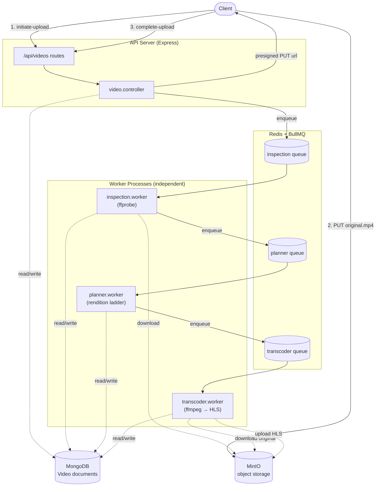

# Diagram 1 — System Architecture

High-level view of components and how they connect. The API server and the
three workers are separate processes; queues (Redis/BullMQ) decouple them, and
MongoDB + MinIO are the shared state and object stores.

