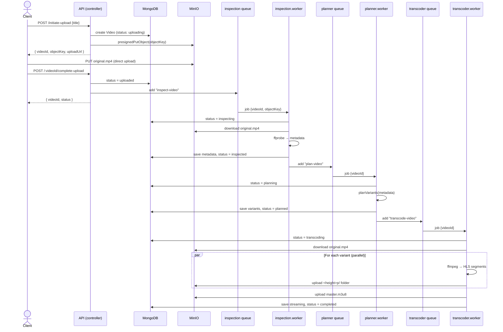

# Diagram 2 — End-to-End Pipeline Sequence

Time-ordered view of a single video moving from upload to a completed HLS
stream. Each worker updates the `Video.status`, does its work, then hands off to
the next queue.

