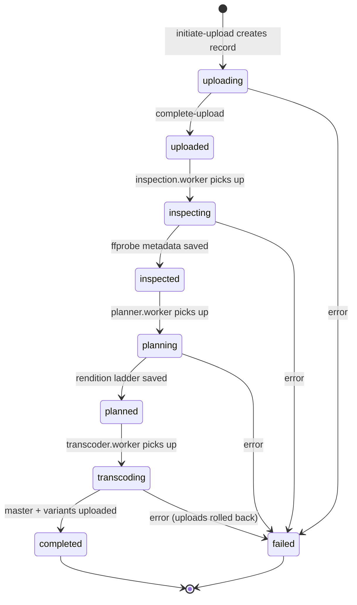

# Diagram 3 — Video Status State Machine

The `status` field on the `Video` document (see `src/models/video.model.ts`)
acts as a state machine threaded through the whole pipeline. Any stage can
transition to `failed` on error; the worker `catch` blocks set it and rethrow so
BullMQ records the job failure.

**Notes**
- `uploading → uploaded` is the only transition driven by the API; everything
  after is driven by workers.
- On `transcoding → failed`, the transcoder rolls back partial uploads
  (`removeObjects(uploadedKeys)`) before marking the video failed — all-or-nothing.
