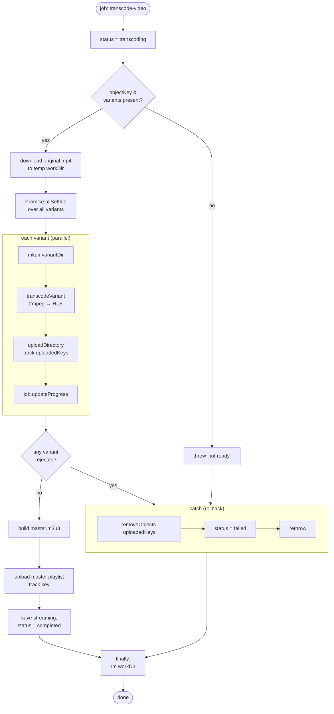

# Diagram 4 — Transcoder Worker Internal Flow

Detailed control flow of `src/workers/transcoder.worker.ts`, including the
parallel per-variant transcode, the all-or-nothing failure handling, and
cleanup. This is the most involved stage in the pipeline.

**Key design points**
- Uses `Promise.allSettled` (not `Promise.all`) so every variant finishes and
  `uploadedKeys` is fully populated before any rollback runs.
- Width per rendition is derived from the source aspect ratio and forced even
  (`widthFor`), because x264 requires even dimensions.
- All-or-nothing: if a single variant fails, the whole job fails and every
  uploaded object is removed — no half-published streams.
- `finally` always removes the temp working directory.
